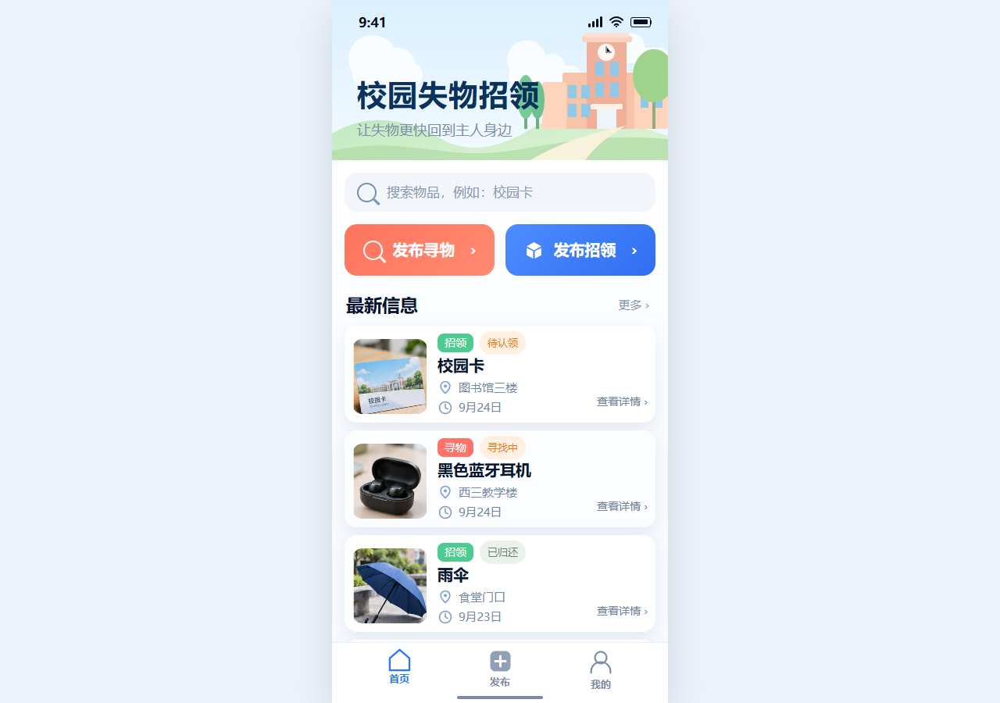

<div align="center">

# 校园失物招领

**让失物更快回到主人身边**

2026 秋软件工程第二次结对作业 · Web 程序实现


</div>

## 项目简介

本项目使用原生 HTML、CSS 和 JavaScript 实现校园失物招领流程，核心操作为：

```text
发布信息 → 浏览或搜索 → 查看详情 → 联系发布者 → 发布者修改状态
```

项目支持寻物与招领发布、组合筛选、详情查看、复制联系方式、我的发布、状态修改和个人资料编辑，并对加载、空结果、表单错误及操作结果提供反馈。

项目没有后端和构建步骤，数据保存在当前浏览器的 `localStorage` 中。普通测试人员直接用 Chrome 或 Edge 打开 `index.html` 即可运行。

<p align="center">
  
</p>

## 目录结构

```text
web_development/
├─ index.html                    # 网页入口和各页面 HTML 模板
├─ assets/
│  ├─ css/
│  │  ├─ tokens.css             # 颜色、尺寸和阴影等设计变量
│  │  ├─ base.css               # 页面重置、基础布局和通用样式
│  │  ├─ components.css         # 底部导航和物品卡片等公共组件
│  │  └─ pages.css              # 首页、发布、搜索、详情和个人页
│  ├─ images/
│  │  ├─ figma/                 # Figma 原型插图、图标和示例图片
│  │  └─ item-placeholder.svg   # 图片异常时使用的占位图
│  └─ js/
│     ├─ app.js                 # 初始化本地数据并启动统一路由
│     ├─ router.js              # 统一解析和分发 Hash 路由
│     ├─ publish-controller.js  # 处理首页、发布表单和成功页
│     ├─ feature-controller.js  # 处理搜索、详情和个人相关页面
│     ├─ core/
│     │  ├─ status.js           # 状态文字转换规则
│     │  └─ validators.js       # 发布表单和联系方式校验
│     ├─ data/
│     │  ├─ demo-data.js        # 首次运行使用的演示数据
│     │  └─ store.js            # localStorage 初始化和读写
│     ├─ services/
│     │  └─ item-service.js     # 查询、发布、详情和状态业务
│     ├─ ui/
│     │  └─ item-card.js        # 首页和搜索页复用的物品卡片
│     └─ pages/
│        ├─ home.js             # 首页
│        ├─ home-preview.js     # 首页独立预览备用脚本
│        ├─ publish.js          # 发布表单和成功页
│        ├─ search.js           # 搜索、筛选和结果状态
│        ├─ detail.js           # 详情和联系方式弹层
│        └─ my.js               # 个人资料、我的发布和状态修改
├─ docs/
│  ├─ 双人Web开发文档.md         # 需求、接口、分工和协作约定
│  ├─ 作业要求.pdf               # 课程作业要求
│  └─ images/                   # README、博客和验收截图
├─ tests/                       # Vitest 自动化测试
├─ package.json                 # 测试命令和开发依赖
├─ package-lock.json            # npm 依赖版本锁定
└─ README.md                    # 项目说明
```

`node_modules/` 由 `npm ci` 自动生成，只用于运行测试，不需要修改或提交。

当前路由由 `router.js` 统一管理：它解析浏览器 Hash，将首页和发布相关地址交给 `publish-controller.js`，将搜索、详情和个人相关地址交给 `feature-controller.js`；`app.js` 只负责初始化数据并启动路由。

## 运行方法

### 直接打开（推荐）

1. 克隆仓库：

   ```bash
   git clone https://github.com/xswlhtj/web_development.git
   cd web_development
   ```

2. 使用 Google Chrome 或 Microsoft Edge 打开根目录下的 `index.html`。
3. 浏览器地址栏会显示类似下面的地址：

   ```text
   file:///D:/web_develop/web_development/index.html#/home
   ```

4. 页面出现“校园失物招领”和底部“首页、发布、我的”导航，即表示运行成功。

普通运行无需安装 Node.js、数据库或第三方框架。

### 本地静态服务器（备用）

如果浏览器限制本地文件访问，可在安装了 Python 3 的电脑上运行：

```bash
python -m http.server 8000
```

然后访问 [http://localhost:8000](http://localhost:8000)。

测试结束后，在终端按 `Ctrl+C` 关闭服务器。两种运行方式任选一种即可，不要同时打开后比较数据，因为它们使用不同的本地存储。

## 使用说明

1. **浏览和搜索：** 首页展示最新信息；点击搜索框或“更多”，可按关键词、寻物/招领类型和物品类别筛选。
2. **发布信息：** 选择寻物或招领，填写名称、类别、日期、地点和联系方式等必填项后提交。图片采用单图模式，可以预览、替换和删除；联系方式需要先选择 QQ、微信或手机号。
3. **查看详情：** 点击物品卡片查看对应内容。未完成的记录可以打开联系方式弹层并复制联系方式；完成记录不会继续引导联系。
4. **管理发布：** 进入“我的 → 我的发布”，可筛选自己的记录。寻物可改为“已找到”，招领可改为“已归还”，已完成记录不能重复修改。
5. **编辑资料：** 进入“我的 → 编辑资料”，可以修改姓名、QQ、手机号、微信和常用校区/宿舍区，保存后刷新仍会保留。

## 自动化测试

自动化测试需要 Node.js 22.12+（也可使用 Node.js 24）和 npm：

```bash
npm ci
npm test
```

测试覆盖存储、表单校验、搜索筛选、详情读取、我的发布和状态修改。

其中 `npm ci` 按 `package-lock.json` 安装固定版本依赖；`npm test` 执行全部测试。网页本身无需运行这两个命令。

## 数据重置

如需恢复初始演示数据，请按 `F12` 打开开发者工具，在 Console 中执行：

```javascript
localStorage.removeItem("lost-found-items-v1");
localStorage.removeItem("lost-found-profile-v1");
location.reload();
```

不同浏览器以及 `file://`、`http://localhost:8000` 两种运行方式使用不同的本地存储，数据不会自动同步。

## 建议验收步骤

测试人员可以按以下顺序复现完整流程：

1. 在首页点击“更多”，确认可以进入全部搜索结果。
2. 输入关键词并切换类型、类别筛选，确认结果随条件变化。
3. 发布一条带图片和联系方式类型的寻物或招领信息。
4. 在发布成功页进入“我的发布”，确认刚发布的记录存在。
5. 打开该记录详情，检查图片、物品内容和联系方式类型。
6. 返回“我的发布”修改记录状态，确认列表和详情同步更新。
7. 编辑个人资料并刷新页面，确认修改仍然保留。

如果双击 `index.html` 后页面没有正常显示，可改用上面的 Python 静态服务器方法；如果演示数据与预期不同，可先执行“数据重置”后再测试。

详细需求、接口和成员分工见 [双人 Web 开发文档](docs/双人Web开发文档.md)，课程要求见 [作业要求](docs/作业要求.pdf)。
